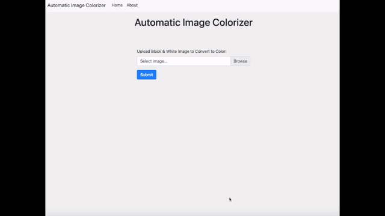

# Automatic Image Colorizer

<p align="center">
  
</p>

Function: Automatically colors black & white images 

Personal Project. Web development using Python (Flask). Modify the algorithm for website integration. Deployment on AWS cloud.

Based off of a pre-trained image colorization [algorithm](https://arxiv.org/abs/1603.08511) made by Richard Zhang, Phillip Isola, and Alexei A. Efros.

### Instructions

- Go to the website: 
- Upload a black and white image (hint: landscapes and portraits work the best)
- Press 'Submit' and wait for the algorithm to finish its job (bigger images take longer)
- That's it!

### Demo


<p align="center">
  
</p>


#### Citation

```
@inproceedings{zhang2016colorful,
  title={Colorful Image Colorization},
  author={Zhang, Richard and Isola, Phillip and Efros, Alexei A},
  booktitle={ECCV},
  year={2016}
}

@article{zhang2017real,
  title={Real-Time User-Guided Image Colorization with Learned Deep Priors},
  author={Zhang, Richard and Zhu, Jun-Yan and Isola, Phillip and Geng, Xinyang and Lin, Angela S and Yu, Tianhe and Efros, Alexei A},
  journal={ACM Transactions on Graphics (TOG)},
  volume={9},
  number={4},
  year={2017},
  publisher={ACM}
}
```